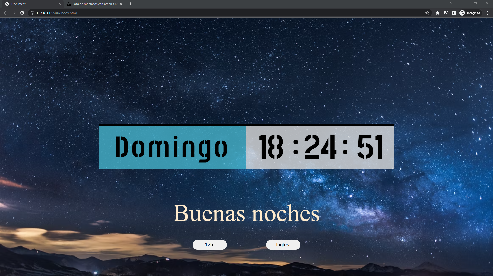

# Reloj-digital

## Inpiracion del proyecto & objetivo

- El objetivo del proyecto es aprender a modificar el doom con JavaScript y poder poner un reloj que te muestre tanto la hora como la fecha  y el día actual.
- Aparte de eso, quiero que se pueda cambiar el formato del reloj de 24h a 12h.
- Tambien quiero que el fondo cambie dependiendo de la hora del dia mañana,tarde,noche.
- Tambien quiero que se pueda cambiar el lenguaje del reloj de Español a Ingles.

El diseño web se ha creado en [Figma](https://www.figma.com/file/kP0SJhf4iDDa9kAzsz1LM1/Github-projects?node-id=0%3A1) por Carlos cruz valencia

Puedes visitar el proyecto en [Githubpages](https://carloscruzvalencia.github.io/Reloj-digital)

## Links de interes
<!-- link a correo -->
<code> <a href="mailto:a2carcruzinfo@gmail.com"></a></code>
<code><a a href="https://www.figma.com/file/kP0SJhf4iDDa9kAzsz1LM1/Github-projects?node-id=0%3A1"></a></code>
<code><a a href="https://www.linkedin.com/in/carlos-cruz-valencia-564514162/"></a></code>

## Tecnologias usadas

Ide

<code></code>

Programas usados

<code></code>
    
lenguajes/frameworks usados

<code></code><code></code><code></code><code></img></code>


## Estado del proyecto

|Trabajando en el proyecto|:x:|
| -------------------------- | :----------------: |
| Web responsive          |:heavy_check_mark:|
| Hosting                 |Githubpages|
| Hosting disponible      |:heavy_check_mark:|  
| Dispone de trello       |:x:| 

## documentacion del proyecto
<details >
<summary>⚙️Documentacion del proyecto⚙️</summary>

1. Creacion del diseño de la pagina web en ``figma``
    

2. Se añade el fondo a la web con un background image
    
3. Se añade el reloj a la web
    
4. Se crea el javascript para el reloj
    
5. Se añade un saludo al usuario y el fondo cambia segun la hora del dia aparte de dos botones para cambiar el formato de hora y el idioma de la pagina
    
    
    
6. Se crea el javascript para el boton de cambio de formato de hora
    
7. Se crea el javascript para el boton de cambio de lenguaje de la pagina
    

</details>

## Vista previa del proyecto


## Licencia

Este proyecto está bajo la Licencia (MIT) - mira el archivo [LICENSE.md](./LICENSE)  para mas detalles

<!-- ## !codigo temporal¡
## git update code
```shell
git add -A && git commit -a -m \"update\" && git push
```

## sass compiler code
```shell
sass -w --style compressed static/styles/sass/main.scss static/styles/css/main.css
``` -->

<!-- emojis  -->
<!-- https://tutorialmarkdown.com/emojis -->
